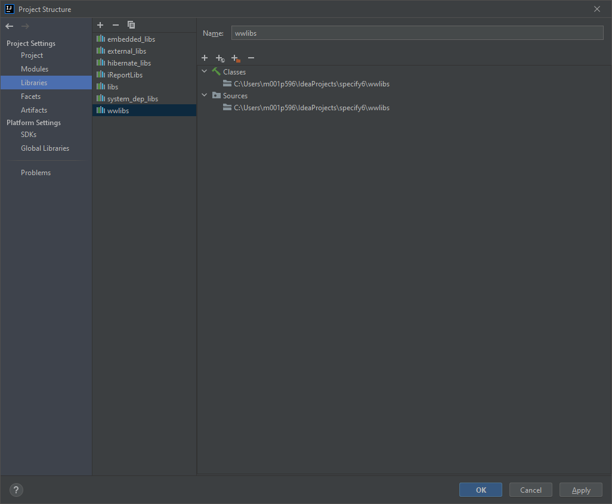
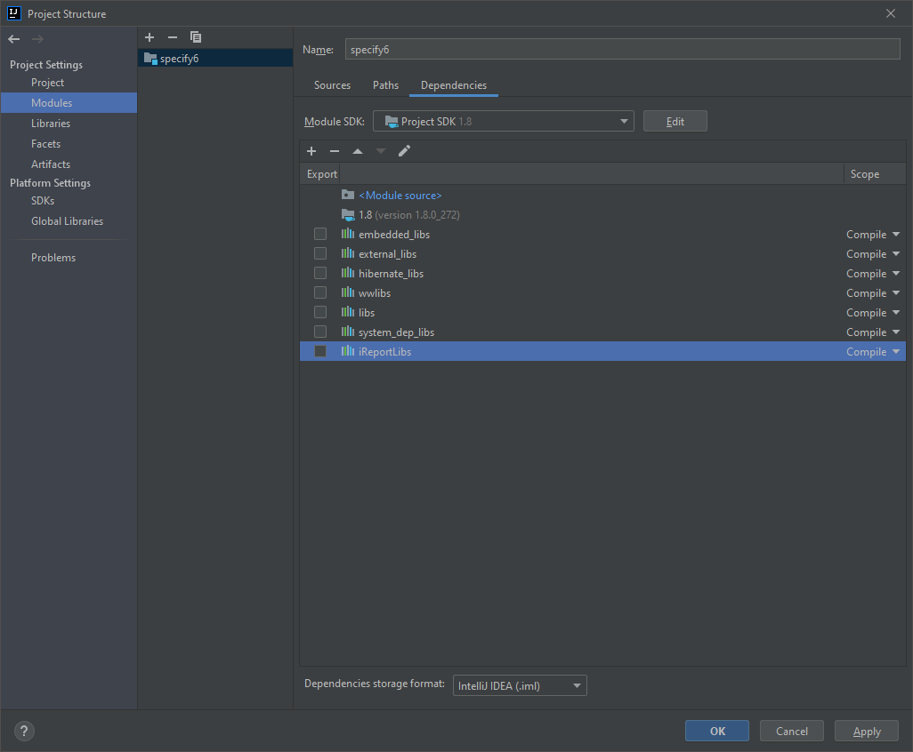
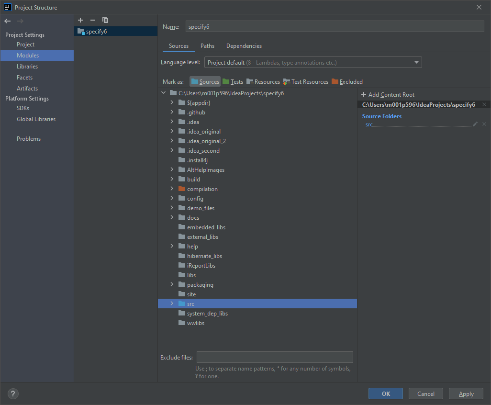
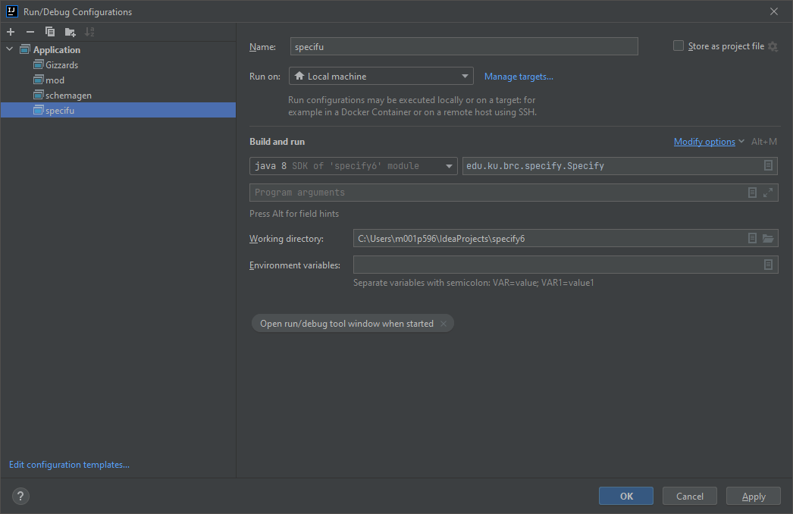

# Configuring Specify 6 Development Environment

These instructions were tested on Windows, Fedora and macOS (Intel).

[Install Amazon Corretto
8](https://docs.aws.amazon.com/corretto/latest/corretto-8-ug/downloads-list.html)

[Install IntelliJ](https://www.jetbrains.com/idea/)

Clone the repository:

```zsh
git clone https://github.com/specify/specify6
```

Open the cloned repository in IntelliJ.

Go to `File -> Project Structure`. Then, on the side bar under *Project
Settings* choose *Libraries* and add the following folders **one at a time**:

```yaml
embeeded_libs
external_libs
hibernate_libs
iReportLibs
libs
system_dep_libs
wwlibs
```



Then, select *Modules* from the sidebar and open the *Dependencies* tab.

Select `iReportLibs` and move it to the last position.



Then, select *Sources* tab and mark the `src` directory as "Sources". Also,
mark `compilation` as "Excluded".



Press "Ok" to close the Project settings window.

Open `Build -> Rebuild Project` and wait for the process to finish (there
progress bar at the bottom of the screen would disappear once finished)

Finally, open `Run -> Edit Configurations...`. Click on the `+` button and
select "Application" from the list.

Specify any name for the configuration. Under *Build and run*, choose Java 8.
In the *Main Class* field specify `edu.ku.brc.specify.Specify`. If the field
has red outline, than something is not correct. Please retrace your steps.

Here are the entrypoint classes for other applications:

```yaml
Specify 6 application - edu.ku.brc.specify.Specify
Data Model Generator (Schema Updater) - edu.ku.brc.specify.tools.datamodelgenerator.DatamodelGenerator
SpWizard (Database setup) - edu.ku.brc.specify.config.init.SpecifyDBSetupWizardFrame
```



Click *Ok* to close the window.

Now, the "Run" and "Debug" buttons in the top bar should be active.
Don't forget to rebuild the project after making changes.
